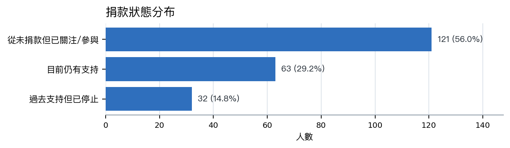
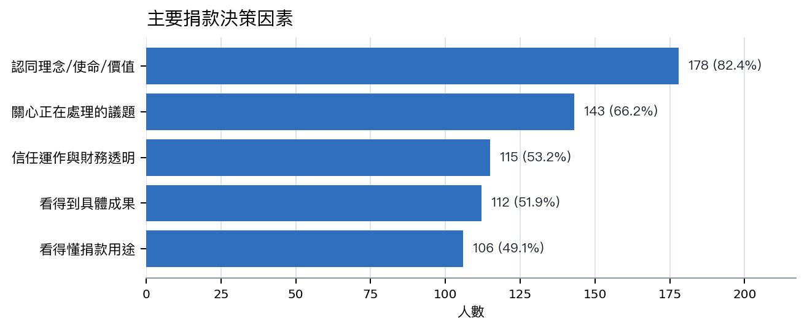
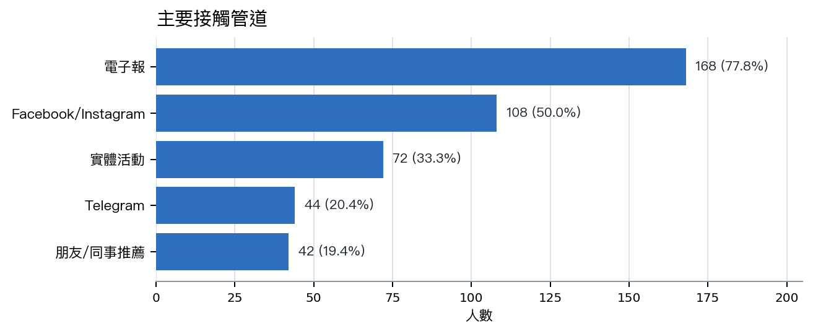

# OCF 募款轉換與續捐挽回方案

Generated at: 2026-06-05  
Source freshness: OCF supporter survey snapshot, 216 responses  
Personal emails omitted

## Executive Summary

- **先把募款主力放在已觸及但未捐款者。** 問卷中 121 人、56.0% 是「從未捐款但已關注或參與」；這是溫受眾，不是陌生名單，最適合用低門檻月捐與清楚用途轉換。
- **續捐挽回要處理兩種摩擦：財務壓力與影響力不清楚。** 曾捐但停止者有 32 人，停止原因以個人/家庭預算調整最多，其次是不清楚具體影響力與信用卡到期忘記續捐。
- **訊息主軸應從理念延伸到可見成果。** 理念認同是最大驅動，但透明度、具體成果、捐款用途也都超過或接近半數；募款頁與電子報應把每月支持換來的能力講清楚。

## 分析名詞與模型解釋

以下名詞來自皮爾森問卷設計文件，用來把「為什麼支持 OCF」拆成可分析、可溝通、也可轉成募款策略的心理與行為變項。

### RPI（遞迴公眾認同）

支持者是否把開源、開放資料、數位基礎設施視為公共財，並把支持 OCF 理解成公民實踐。問卷設計中以 A2 四題 1-7 分平均衡量。

在本報告中的用途：RPI 高者適合長期會員、年捐、議題倡議型溝通；RPI 低者需要更具體的成果與行動門檻。

### Movement 路徑

因隱私、自由、民主、公民權利、數位人權、網路自由、開放治理等價值而支持 OCF。

在本報告中的用途：適合用議題行動募款、政策成果、風險說明與價值一致性來溝通。

### Utility 路徑

因 OCF 支援自己參與或使用的社群、工具、活動、行政法人服務、開源協作場景而支持。

在本報告中的用途：適合用社群基礎建設、活動後勤、行政支持、工具維護與「捐款讓社群能繼續運作」來溝通。

### M/U 分數

M 是 Movement 題組平均，U 是 Utility 題組平均；兩者可畫成四象限，看支持者主要由價值、效用或兩者共同驅動。

在本報告中的用途：後續若欄位完整，可把同一份名單拆成 Movement 主導、Utility 主導、整合型核心、邊緣支持者四類。

### 整合型核心支持者

Movement 與 Utility 都高，既認同 OCF 的價值倡議，也感受到 OCF 對社群與工具的實際支持。

在本報告中的用途：最有機會升級為穩定月捐、年捐、志工、倡議擴散與高互動支持者。

### 邊緣支持者

Movement 與 Utility 都低，或只是對議題有興趣但還沒有形成強烈身份認同與行動理由。

在本報告中的用途：需要更短、更具體的入口，例如單一議題、低額首次月捐、活動後追蹤，而不是重理念文本。

### 三大使命心理感知

把 OCF 工作拆成三組心理感知：使命一是基礎設施與後勤，使命二是數位人權與開放治理倡議，使命三是開放文化共同體。

在本報告中的用途：幫助募款文案不要只講「支持 OCF」，而是依支持者在意的任務講成果、信任、價值或社群身份。

### 信任、專業、穩定

使命一的核心感知：支持者是否相信 OCF 專業、透明誠信，並能長期穩定支援社群基礎設施。

在本報告中的用途：對 Utility 支持者和曾捐者特別重要，可放在續捐、年報、財務透明與行政支持案例中。

### 價值一致、有效性、自我效能

使命二的核心感知：支持者是否覺得 OCF 的價值與自己一致、工作真的有效、自己的小額捐款也能形成影響。

在本報告中的用途：對 Movement 支持者特別重要，適合用在數位權利、開放治理、平台監督等議題募款頁。

### We-language 與參與行為

使命三的共同體感：支持者談 OCF 支援社群時是否使用「我們」而非「他們」，以及過去 12 個月的參與頻率。

在本報告中的用途：用來判斷是否有社群身份與行動深度，適合轉成活動後追蹤、志工招募和社群型月捐。

### NPS

0-10 分的推薦意願指標，通常用來觀察支持者是否願意把 OCF 推薦給朋友或同事。

在本報告中的用途：不是直接募款率，但能輔助判斷口碑擴散潛力與整體支持者關係健康度。

### 95% CI

平均分的不確定範圍；樣本越小，區間通常越寬，解讀時越需要保守。

在本報告中的用途：避免把小樣本差異過度解讀成穩定結論，特別適合用在年度比較或分群比較。

### Ward's method（階層式聚類）

一種探索性分群方法，適合樣本數中等時用 RPI、M、U、三大使命感知等變項找出相似支持者群。

在本報告中的用途：216 份樣本若欄位完整，可做探索性分群；但應視為策略假設，不宜當成精準個人標籤。

### k-means / LPA

樣本數較大時可使用的分群方法。皮爾森文件建議樣本超過 500 再考慮更正式比較 k=3/4/5 或 LPA。

在本報告中的用途：可作為下一年度資料量增加後的進階分析，不建議在目前樣本下過度使用。

## 最大機會是 121 位已關注但未捐款者

這群人已經在 OCF 的觸及半徑內，應該被視為第一波轉換名單。他們占樣本 56.0%，規模接近現有與曾捐者合計的 1.27 倍。行動重點不是再介紹 OCF 是誰，而是降低第一次行動門檻：清楚說明 NT$300/600/月支持什麼、三個月後會收到什麼成果回報、以及可以怎麼調整金額。

| 優先 | 受眾 | 問卷依據 | 主要方案 | 主要管道 |
|---:|---|---|---|---|
| 1 | 未捐款但已關注/參與者 | 121 人，占 56.0%；最大溫受眾 | 第一次月捐 NT$300/600，三個月成果回報 | 電子報、社群回流、活動後追蹤 |
| 2 | 曾捐但停止者 | 32 人，占 14.8%；預算、影響力不清楚、信用卡到期是主要摩擦 | 降額不中斷、單次支持、付款更新提醒 | Email/電子報分眾 |
| 3 | 議題驅動型支持者 | 議題是 66.2% 的捐款決策因素 | 健保資料庫、平台治理、數位安全等議題行動募款 | 電子報、社群切片、媒體合作 |
| 4 | 高收入/專業技術支持者 | 收入 100 萬以上與技術職群具加碼潛力，但需 CRM 驗證 | Supporter Circle、年捐、企業媒合捐 | 電子報、社群夥伴、企業轉介 |

## 訊息要同時滿足理念、議題、透明與成果

理念是底盤，但不夠完成轉換。82.4% 提到認同組織理念，66.2% 提到關心議題；同時 53.2% 在意信任與財務透明、51.9% 在意具體成果、49.1% 在意捐款用途。每封募款信和捐款頁都應同時回答：OCF 正在處理什麼問題、捐款形成什麼能力、支持者多久會看到回報。

## 電子報做主轉換，社群與活動做回流

電子報是最強的募款主幹。168 人、77.8% 提到電子報；Facebook/Instagram 也有 50.0%，實體活動 33.3%。建議把轉換動作集中在電子報與捐款頁，社群負責短故事和議題切片，活動則安排現場和活動後 48 小時追蹤。

## 續捐挽回不該只說「請再支持」

停止捐款者的第一個原因是預算，第二層才是信任與影響力。因此挽回信應提供降額不中斷、一次性支持、信用卡更新提醒、以及一年成果回顧。對財務壓力者，低額續捐比硬推原金額更合理；對影響力不清楚者，案例與透明用途比情感呼籲更重要。

| 流失摩擦 | 問卷依據 | 建議回應 | 觀察指標 |
|---|---|---|---|
| 個人/家庭預算調整 | 19/32 人，59.4% | 提供降額不中斷與單次支持，不以原金額作唯一續捐路徑 | 降額續捐數、單次支持數、取消率下降 |
| 不清楚具體影響力 | 7/32 人，21.9% | 用年度成果回顧、案例、透明用途頁回應 | 成果頁點擊、回覆、重新捐款 |
| 信用卡到期忘記續捐 | 6/32 人，18.8% | 付款更新提醒與簡化更新流程 | 付款更新完成率、失敗付款復原率 |

## Recommended Next Steps

1. 兩週內上線第一次月捐路徑。建立 NT$300/600/月方案，文案聚焦「開源社群與數位權利基礎建設」，並承諾三個月成果回報。
2. 四週內寄出續捐挽回序列。第一封給成果回顧與降額選項，第二封處理信用卡/付款更新，第三封提供單次支持和議題行動入口。
3. 把募款頁拆成議題入口。至少先測開源社群、數位人權/網路自由、開放政府/公民科技三個入口。
4. 建立最小衡量表。每一波追蹤寄送數、點擊、捐款頁到達、單次捐、月捐、降額續捐、取消/未完成付款；等 CRM 或金流資料可用後再補 LTV 與留存。

## Further Questions

- 捐款系統是否支援降額不中斷、信用卡到期提醒、以及付款失敗自動通知？這會直接影響續捐挽回成效。
- 問卷回覆能否以隱私安全方式對接捐款紀錄？若可，就能分辨高意願低捐款、高捐款低互動、以及真正有流失風險的族群。
- 電子報平台是否能提供分眾點擊與捐款頁轉換？這會驗證電子報主轉換假設。

## Caveats And Assumptions

本方案是問卷與語意層支持的決策建議，不是 CRM 或金流驗證結果。樣本為 216 份 OCF 支持者問卷回覆，可能高估既有觸及圈層；捐款狀態為自我回報，不能直接等同於實際捐款紀錄、流失率、LTV 或轉換率。個人 email 未納入本報告。

## Source Details

Primary source: OCF supporter survey report and OCF fundraising semantic layer, generated 2026-06-05 from 216 survey responses.

- Terminology and model definitions are based on the Pierson survey design document, created 2026-05-07, 10 pages.
- Donation status and channels are self-reported survey aggregates.
- Multi-select shares use 216 responses as the denominator unless the row is a lapsed-only reason.
- Personal email values were omitted from the analysis and PDF/Markdown report.
- Missing high-value validation sources: donor CRM/payment exports, newsletter clicks, campaign conversion, event attendance, and actual recurring donation history.
