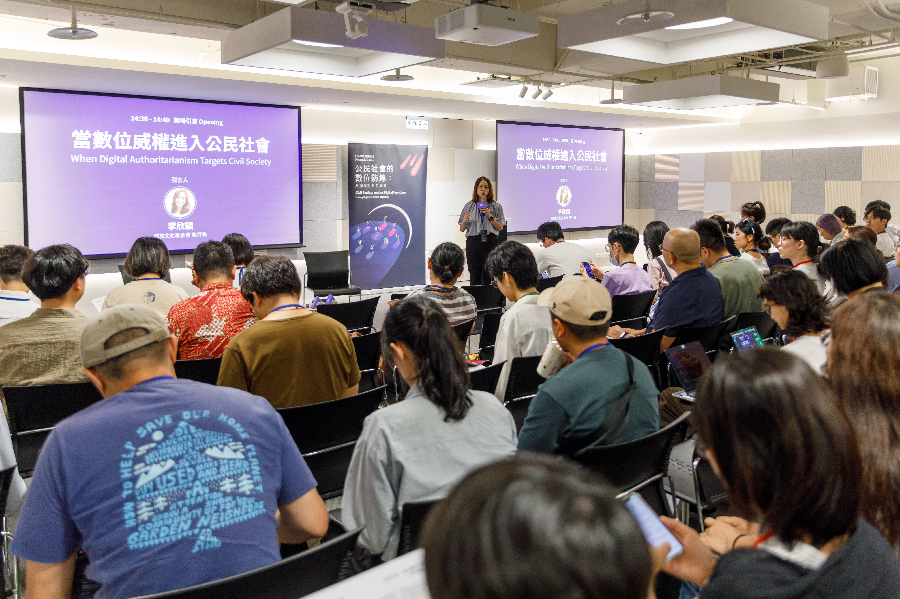
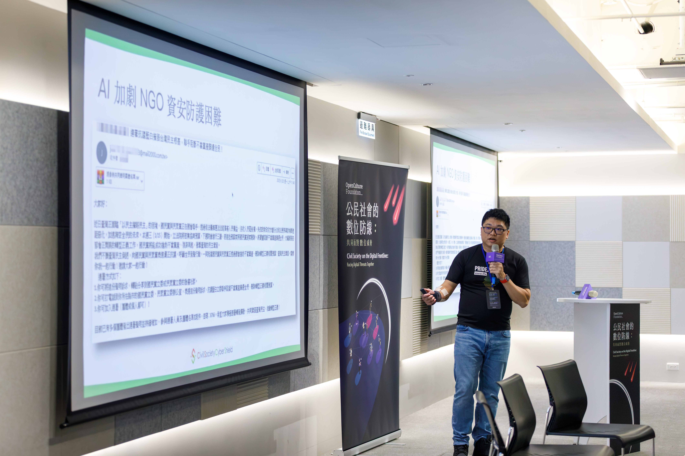
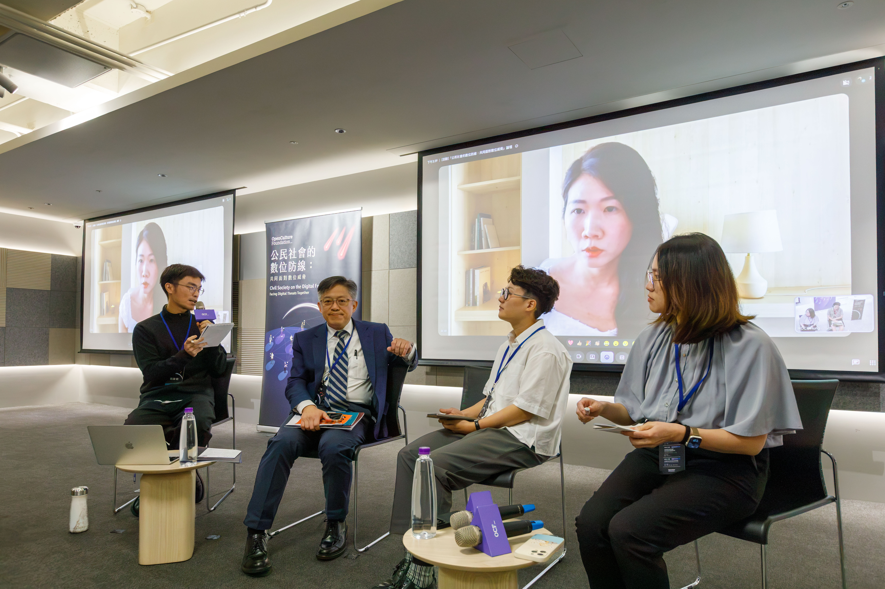
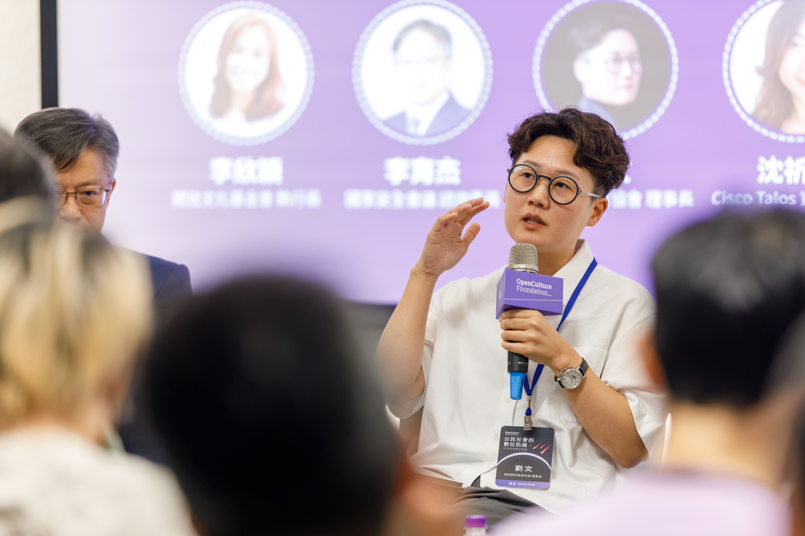
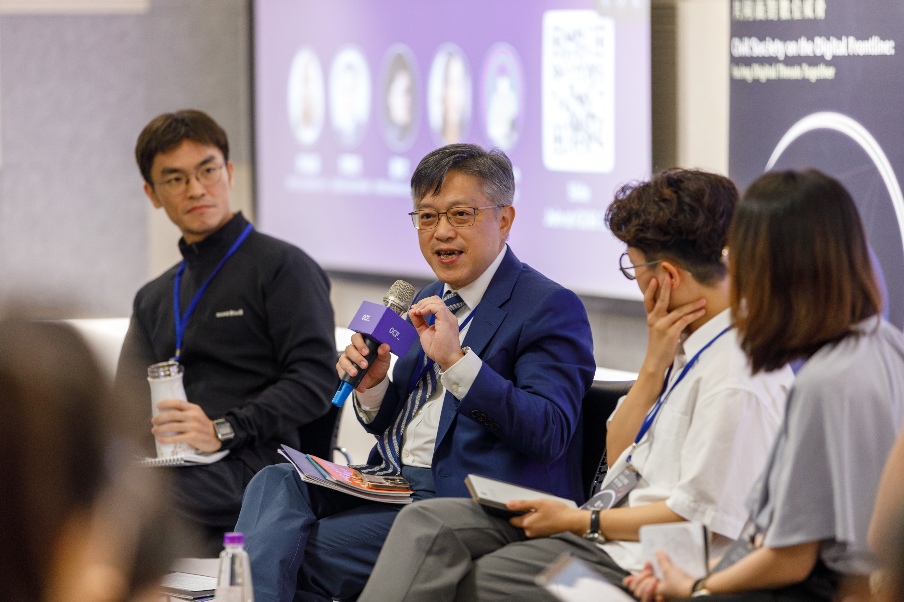
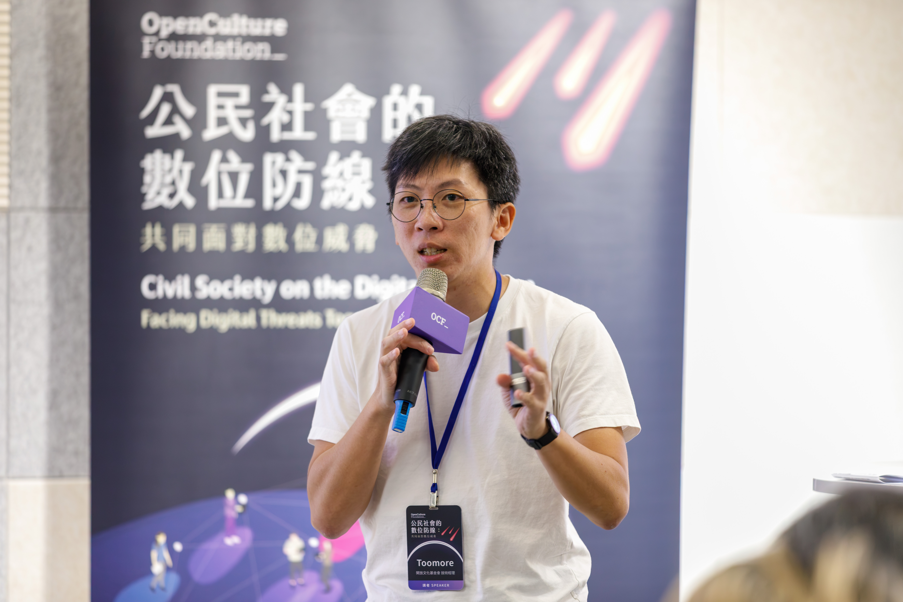
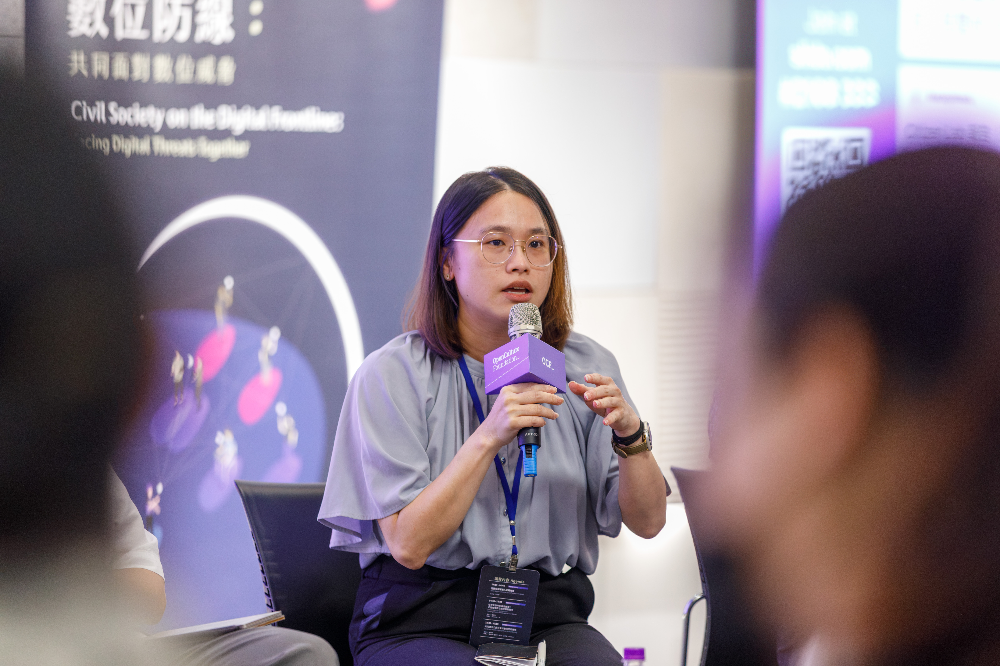

# 【2026 OCF 數位安全論壇－活動紀錄】數位木馬兵臨城下——面對數位攻擊，公民社會如何培養信任與韌性？

  撰文／實習生 Heng 
  編輯／Jin

7 月 20 日，開放文化基金會（OCF）舉辦「公民社會的數位防線：共同面對數位威脅」論壇。上半場發表兩份研究報告，《守護倡議之聲》分享「資安陪伴計畫」的實務經驗與觀察；《信任的代價》聚焦近期針對公民團體的資安攻擊案例。下半場的圓桌論壇則囊括國內外資安研究者、公民社會工作者、政策顧問與技術社群代表，共同討論數位攻擊造成的影響，以及各方該如何應對、強化社會韌性。

*開放文化基金會（OCF）執行長李欣穎強調，NGO 是公民社會數位安全的重要節點。*

## 木馬如何攻城：APT 攻擊的最新趨勢

公民團體資安暨隱私交流計畫（CSCS）資安講師 ZK 揭露，早在十年前，就有超過三分之一的臺灣 NGO 曾遭到數位入侵，當中又以低成本、誘騙效果佳的釣魚信件占大宗。如今隨著數位技術、AI 發展越趨成熟，攻擊不但不減反增，甚至花招百變，有心人士擅長結合目標對象的人際網絡、周遭環境資訊，客製化以假亂真的釣魚信件，誘導受害者點開惡意連結，在其主機安裝木馬程式，並竊取電腦中的重要資料。這種將日常工具「武器化」的手法，是多個具有國家背景的 APT（Advanced Persistent Threat，進階持續性威脅）組織反覆使用的戰術。

*AI 的發展讓本來就低成本、高成功率的釣魚信攻擊，變得更加難以防範。*

事實上，近年針對公民組織、倡議團體的 APT 資安攻擊不僅發生在臺灣，而是世界的共同趨勢。Cisco Talos 資安研究員沈祈恩（Ashley）在論壇中分享近年的跨國資安攻擊型態，多數案例為威權政府聘請專業團隊，針對特定敏感議題有關的組織及人物所發動。例如：中國主要針對西藏、維吾爾族、臺灣，以及批評中國或移居海外的異議人士；俄國則對美國、英國支持烏克蘭的 NGO 展開攻擊；北韓則有針對脫北者組織發動的資安攻擊。

此外，攻擊者常用的入侵管道也五花八門，包含雲端服務、行動裝置，甚至直接在組織內的網路設備安裝惡意程式。例如，中國曾出現安裝在閘道器的監控軟體 DKnife，主要用於監控中國人民。DKnife 不僅能夠挾持軟體更新以傳遞惡意程式，也能透過替換中繼站的方式，獲取使用者的應用程式活動，監控內容涵蓋 WeChat、Signal、購物 App、叫車服務及交友軟體等。

*圓桌論壇講者包含，國安會諮詢委員李育杰、黑熊民防教育協會理事長劉文、Cisco Talos 資安研究員沈祈恩（線上參與），以及開放文化基金會執行長李欣穎。*

而針對行動裝置的攻擊，最常見的便是透過社交工程假冒記者或學生，以訪問、提供資料，甚至送禮等名義傳送 WhatsApp 或 LINE 訊息。其中一個案例便是假冒國際特赦組織與西藏流亡人士接觸，誘騙對方點開會下載惡意程式的短網址，並將電腦資料回傳至攻擊者主機。

CSCS 資安講師 Pellaeon 也補充，近期研究發現有兩群來自中國的攻擊者，透過 Email 作為突破點，假冒國際調查記者同盟（ICIJ）提出訪談要求，嘗試與受害者取得聯繫，這類型的攻擊大部分是中國政府透過承包商執行。除此之外，也有攻擊者透過偽造 Google 登入介面，讓放下防備的受害者輸入密碼；或是開發一套應用程式，要求使用者授權所有帳號資料。如果不注意而按下同意，就會讓攻擊者能無限制地透過 Google 伺服器存取帳號的詳細資料。

（編按：提醒讀者們，想知道自己的 Google 帳號提供權限給哪些應用程式，可以前往 [Google 帳戶](https://myaccount.google.com/)，並點選「連結的應用程式」查看。）

## 城門開給誰？真假難辨下的信任考驗

面對層出不窮、變化多端的攻擊手法，過去臺灣公民團體與人權工作者往往因缺乏專業人員及相關知識，即使心知肚明遭到入侵，卻不知向誰求助。OCF 的「資安陪伴計畫」便是透過長期陪伴，討論適合各組織的資安目標，陪伴公民團體自我強化。

擔任 OCF 資安陪伴計畫成員之一的 Toomore，也在論壇中分享自己與公民團體及人權工作者合作的第一線經驗，他強調，「信任」是執行計畫時最重要、也最難達成的一步。願意接受資安檢核與改善，表示公民團體必須向組織外人員詳細揭露自己的組織架構與內部資料，也有許多團體因此卻步，當初並沒有選擇加入。

「究竟該相信誰？」在資安攻擊猖獗的年代，的確是個難以解答的問題。熟悉 NGO 網絡的黑熊民防教育協會理事長劉文指出，過去 NGO 之間時常利用公開場合聊聊八卦、講講各自的內部消息，但在看見第五縱隊滲透 NGO 的案件，以及新型 APT 如何利用社交工程獲取人際網絡資料後，他在交流時會更謹慎地思考：「究竟哪些資訊適合說？這些資訊適合說給誰聽？」

*黑熊民防教育協會理事長劉文提醒，建立議題討論的共同底線，才能強韌公民社會之間的信任。*

不過，劉文也提出，認知作戰的重點便在於瓦解民眾對公民社會的信心，以及對議題的討論與想像。除了第五縱隊的滲透外，許多出現在數位平台的議題論述，也出現認知作戰的痕跡，例如與社工及兒虐議題相關的剴剴案。因此，比起戒慎恐懼，他更在乎團體間是否能建立堅韌的連結與共識，以抵禦來自外界的攻擊。

他強調，臺灣公民團體應採取對於國安的「共同底線」；底線之上，各方可以針對自己專精的事項提出不同倡議，但對底線必須建立共識，才能減少認知作戰的威脅。

對此，國家安全會議諮詢委員李育杰也強調，個人的警覺心是防範數位攻擊最重要的一環，因為每份個資都可能成為對方發動攻擊的素材，公民團體千萬不要認為「自己沒什麼好入侵的」而降低資安意識。有鑑於此，政府也規劃推動免費、普及的資安課程，提供有興趣的民眾上網搜尋學習，並設立 TWCERT 資安通報服務，提供受攻擊的民間組織進行資安通報。

*國家安全會議諮詢委員李育杰強調，每個人都很重要，像是密碼外洩就可能讓帳號變成 DDoS 攻擊的工具。*

## 轉機——由互助打造的公民社會

然而，在另一方面，緊密的社群連結雖帶來疑慮，也帶來轉機。Toomore 在陪伴計畫中發現，臺灣公民社會有地狹人稠的優勢，相同類型的組織大多連結緊密，或有共同朋友，相較國外更容易建立信任與互助。

除此之外，他也提到，奠定陪伴計畫效果的重要功臣，是最初和各組織討論的「風險評估會議」。原因在於，組織能夠藉此確立「屬於自己」的具體目標，隨後學習對應的資安知識與發想策略時，都能夠更有動力及方向。

如今，一年的陪伴計畫結束，但參與的組織們並不就此停歇，仍然持續強化、調整更適合自己的資安策略。Toomore 也分享，其實公民團體並不缺乏學習專業知識的能力，甚至有時能對同個問題發想出多個有效解方，只是需要專業人士的「確認與核可」才敢採取行動。當想法受到肯認，各組織便有能力客製化適合自身的資安策略，建構屬於自己的數位安全網。

*開放文化基金會的 Toomore 表示，OCF 的資安陪伴計畫就像是副駕駛，輔助公民團體找到提升資安的正確方向。*

開放文化基金會執行長李欣穎也強調，即使資源有限，OCF 目前專注培育第一線公民團體，但若有公民團體願意改變現況，也非常歡迎聯繫 OCF 協助。Toomore 在簡報結尾時也提到，OCF 作為中介者，很希望這些成功案例不只是個案，而是有能力帶動更長遠的影響。最後，他也提問：「我們都會說，第一屆陪伴計畫有 6 個公民團體參與，現在第一屆畢業了，那這些 NGO 是不是有辦法當下一屆的 leader，再去幫助更多人？」

*李欣穎提醒，公民團體除了要時刻瞭解最新的數位攻擊手法，建立彼此之間的信任防線也很重要。*

「資安陪伴計畫」雖已告一段落，論壇也圓滿結束，但針對公民團體的威脅並不會就此停擺。畢竟數位木馬總能變換形體與策略，試圖闖進 NGO 的互信網絡。或許真正能抵禦威脅的城門，並不在於追求毫無破綻的資安系統，或是建立處處提防的社會風氣，而是在共同的警覺中彼此支持，在持續的支持中累積默契，並透過默契築起公民社會的信任與韌性。

若您關心公民社會的數位安全議題，或想了解 OCF 如何陪伴公民團體與人權工作者提升數位韌性，歡迎參考 [公民團體與人權工作者資安陪伴計畫](https://ocf.tw/p/defendhrd/)。

※ 本文文字內容採 CC BY 4.0 授權釋出，歡迎標示出處後自由分享、轉載與改作。本文照片除另有註明外，未經授權不得重製、轉載或作其他使用。
