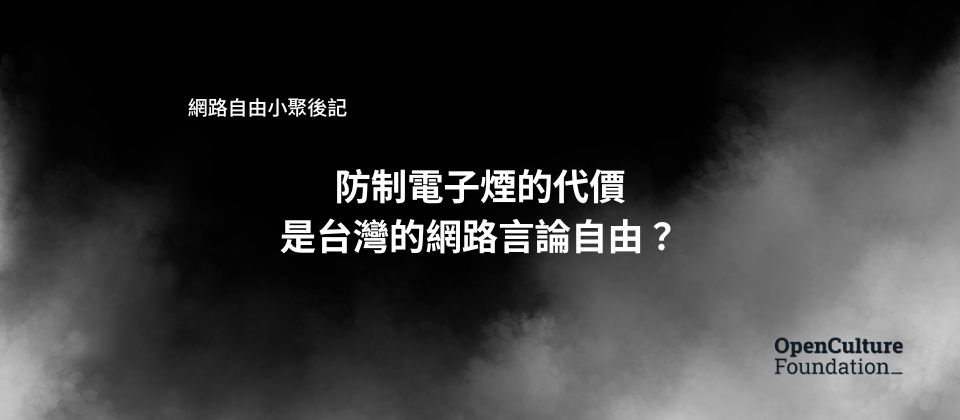

# 防制電子煙的代價是台灣的網路言論自由？

**某位台灣本土社群平台內容審核員，今天早上最重要的工作，不是移除血腥暴力或極端言論，而是全力追殺「糖果」和「香氛」。**

這些在第一線的「數位清潔工」，每天凝視著人性最幽暗的深淵。他們的一般工作，是過濾掉你我永遠不想看見的畫面：斬首影片、虐待兒童、自殺直播、極端的暴力與仇恨言論。許多審核員因此罹患嚴重的創傷後壓力症候群（PTSD），活在焦慮與惡夢之中，他們是網路世界真正的守門人。

但此刻，這位台灣的內容審核者，他眼前的首要目標，是看似人畜無害的「糖果」\*1、「軟糖」、「香氛」、「茶包」，這些詞彙都在禁止張貼的黑名單當中，因為根據國民健康署的「關鍵字清單」，這些都是電子煙的網路代稱。只要他漏看一則，讓一篇討論「哪家香氛最讚」的貼文存活下來，公司就可能收到一張四十萬台幣起跳的罰單。

> \*1：[萬聖節的隱藏危機「糖果」可能是電子煙](https://www.mohw.gov.tw/cp-6646-80331-1.html) - 2024 年 10 月衛生福利部消息

2023 年《菸害防制法》修法通過，增訂禁止在網路或實體店內展示、廣告電子煙或其組合元件。其後，只要國民健康署發現網路平台出現任何跟電子煙、加熱菸有關的貼文，就會被視作宣傳電子煙的廣告，每次開罰四十萬元，看到一次罰一次，迄今已有平台遭裁罰超過千萬。

但最扯的是，哪些詞跟電子煙有關，是由國健署來決定。不僅稀鬆平常的「糖果」、「香氛」外，連「主機」這個關鍵字都被封鎖 \*2，審查關鍵字名單每個月都在持續成長中。

> \*2：[一張罰單40萬起跳！電子煙風暴解析：政府想遏止、業者想配合，問題出在哪？](https://www.bnext.com.tw/article/81943/law-of-electronic-cigarette-3) - 2025 年 2 月數位時代報導

除了恣意擴張的審查關鍵字，國民健康署甚至連民眾的發文也要管。像是某個大學生在宿舍撿到電子煙，順手拍照發到校版上失物招領，光是這篇文，就已讓網路平台損失四十萬。又例如有網友在國內的網路論壇發文，痛罵「政府管制電子煙直銷不力」，並在文章內列出多個「銷售電子煙的境外網站」作為佐證，該文章竟也被認定為是「國內網路論壇在廣告電子煙」。

或者有人上傳了在日本旅遊的短影音，假如畫面不小心拍到路人在抽電子煙，按照國健署的標準，這部影片也算電子煙的廣告，恐讓 FB、YT 平台也慘遭受罰。

**歡迎來到台灣的網路世界。在這裡，我們會為了消滅幾隻蒼蠅，動用大砲試圖把整座廚房轟掉。**

這次的網路自由小聚，聚集了平台業者、法律專家、公民團體與重度網路使用者，一起來探討這個問題。

## 飲鴆止渴，比病灶更致命的解藥

看到這邊，讀者可能會想，現在的網路真的很亂，總不能讓網路充斥著詐騙、假訊息和有害商品吧？渴望安全的網路環境相當合理，問題在於，我們選擇的「解藥」是否正確，是不是飲鴆止渴？

自從《數位中介服務法》草案在爭議中擱置後，台灣的網路治理，就變成了一場由各部會互搶鏡頭的舞台。今天農委會擔心非洲豬瘟，要求平台嚴管「豬肉」貼文；明天金管會憂心投資詐騙，要求平台監控「飆股」字眼；後天中選會緊張選舉，對所有「民調」討論都虎視眈眈。每一個部會，都帶著自己專業領域的「善意」，對平台制定相關規範。他們各自擁有「有害內容」的不同定義、各自訂立的規則，以及各自的罰則。

每個部會都像拿到了一把尚方寶劍，可以對平台頤指氣使。而其中某些部會最愛的武器，就是「嚴格無過失責任」。這邏輯有多荒謬？想像一下如果政府頒布規定：只要公園出現任何一張違規傳單，該里就要被罰款，一單一罰連續罰。你覺得里長會怎麼做？是雇清潔工 24 小時打掃，還是乾脆直接把公園關掉，禁止任何人接近公園？

這正是本土平台的困境。一家本土電商平台的法務在網路自由小聚上苦笑說，他們審查的關鍵字已超過兩萬筆，使用者條款裡塞了六十幾段相關法條。當法律要求網路平台負擔使用者言論的責任，本土新創將難以與封鎖言論能力超群的境外平台競爭是毀滅性的打擊。最終，台灣的網路世界，將只剩下有能力針對使用者內容進行預先審查的跨國巨頭。

## 不該以安全為名打造牢籠

也許你會說：「有這麼嚴重嗎？平台負起責任，乖乖遵守法律不就好了？」

規範的品質決定了一切。在機關糟糕的執法品質下，為了避免麻煩，平台唯一的選擇就是「預先過度審查」。寧可錯殺一百，不可放過一個。其結果就是，看似越來越安全，但也越來越死氣沉沉的網路。

沒有人會說今日的台灣是威權國家，然而，我們必須警覺，行政機關採用的裁罰手段，正迫使所有在台營運的國內外數位平台，去打造威權統治的基礎工具：一套大規模、預防性的言論審查系統，被迫去掃描每一則使用者貼文，過濾那份由行政機關不斷擴增的「敏感詞」時。我們正在以公共衛生、金融安全等良善之名，將言論審查常態化。

我們需要的是能解決問題的規範。廠商花錢買的廣告，跟路人在討論區的貼文是兩回事。執法必須明確區分「付費廣告」和「使用者內容（user generated content, UGC）」，課以不同的責任。不能因為公園裡有人聊天提到電子煙，就認定公園管理者在「幫菸商打廣告」。

此外，我們不會因大樓失火而懲罰管委會，而是看有沒有裝設有效的警報器，並在警報響起時迅速疏散。在網路的情境來說也就是「通知後移除」（Notice and Take Down \*3）。平台在接到執法或行政機關明確通知後，只要迅速處理違法內容，就該免於受罰。

> \*3：[Notice and take down](https://en.wikipedia.org/wiki/Notice_and_take_down) - Wikipedia

民眾真正恐懼的，並非「軟糖」（與其他兩萬個物品）有朝一日真的從網路上絕跡。這背後的核心問題在於：我們絕不應該讓任何一個行政機關，可以跳過正常的法律程序，僅憑一紙公文或一封 email 的「提醒」，就能恣意決定哪些詞彙該從網路的公共討論中消失。這是在建立個危險的先例，賦予行政機關定義語言、劃定思想邊界的權力。假如今日執政者可以把香氛列入黑名單，明天就可能是任何他們更不喜歡的詞彙，例如「抗議」或「批評」。

最後，公民社會需要認真思考、擬定一個能解決台灣網路監管困境的法規範。一場棒球賽不能有十二個主審同時帶著自己寫的規則上場。台灣的數位平台治理，需要一個理解網路文化的主管機關統一權責。立法者需要擔負更多責任，建立釐清關係人利害、保護網路言論自由的安全港規範框架。而各平台則應群策群力，建立有效透明的第三方自律機制。我們期待這些議題能在未來的網路自由小聚中繼續探索，歡迎大家持續關注並參與討論。

---

*本文為網路自由小聚：網路言論自由的界線 - UGC、法律與我們的言論權利 - 活動摘要，由現場參與者協助整理活動現場的發言並摘錄成文，本文採 CC-BY 公眾授權釋出，歡迎自由轉貼利用。*

- 線上討論：[https://groups.google.com/g/coffee-circumvention-tw](https://groups.google.com/g/coffee-circumvention-tw)
- 活動共筆：[https://hackmd.io/efBMZl4ITImkxUOjlmByHg?view](https://hackmd.io/efBMZl4ITImkxUOjlmByHg?view)
